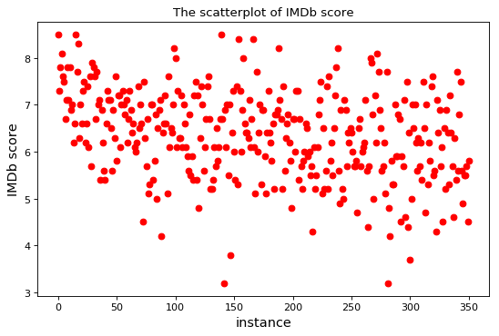
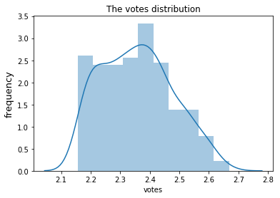
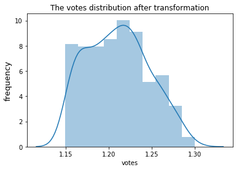
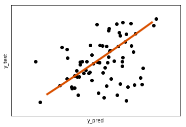

# STATS418-Final-Project

# Table of Contents
1. [Introduction](README.md#Introduction)
2. [Deployment](README.md#Deployment)
3. [Exploratory Data Analysis](README.md#exploratory-data-analysis)
4. [Modeling](README.md#Modeling)
5. [Conclusions](README.md#Conclusions)

## Introduction

This project is intended to predict the number of votes for movies in IMDb using the 2018 movie's information from IMDb. We wanted to find out the relationship between the number of votes and Metascore(scale from 0 - 100) and IMDb (scale from 0 -10) through linear regression model. The data is obtained by webscraping the movie data from IMDb website https://www.imdb.com/search/title?release_date=2018-01-01,2019-01-01&sort=num_votes,desc and parse the HTML into a table. You could find the script for parsing HTML in web_scrap.py, and you can find the modeling code in stats418_main.py. At the end, this model is deployed as an Flask API hosted on Amazon Web Service (AWS). 

## Deployment

The data is obtained by the webscraping movies' information using HTML from IMDb website by sorting the number of votes descending. The total number of instances is 351, and I excluded movies whose `Metascore` are not available. 

Everyone could access this API by following the instruction down below:

**1. To run this API, you will need change to your directory to the docker folder and run the following command line: **
`docker-compose up`

**2. You will need to open a new terminal (be in the same directory) and run the following curl command to get a response**

`curl http://localhost:5000/`

**3. We will pass these through a json formatted input through a curl POST request to the API. This is done as**

`curl -H "Content-Type: application/json" -X POST -d '{"imdb":"6.7", "metascore":"53"}' "http://localhost:5000/votes"`

This should return 
`{
  "predicted votes":52869.3919191900185
}`

Note: You may try different input value to check the predicted number of votes .
**4. To stop this server, press `ctrl-C`. Furthermore, if you need to check any runing docker containers, you should enter `docker container ls` and stop them through `docker container kill <container-name>`**

## Exploratory Data Analysis
First, we wanted to do some exploratory analysis of the data

The scatterplot of IMDb score is represented below:

  

We noted that the number of votes seem to be normally distributed but slightly right skewed.

  

To make it more symmetrical, we apply the normal transformation to the number of votes.

  

## Modeling 
Although the popularity of these movies are not necessarily associated with the rating, we tried to use the linear regression model using IMDb and Metascore to predict the number votes. Surprisingly, we received an interesting result: the mean squared error is 0.0010889836135416554, which is extremely small. The result indicates that the number of votes has linear relationship with IMDb score and Metascore. A possible explanation for this result could be that people still prefer more popular movies than less popular movies. Therefore, the number of votes has linear relationship with IMDb socre and Metascore.

The plot underneath is the `y_test` against `y_pred`

  

## Conclusion
The initiative of this project was to explore the relationships embedded in the number of votes, IMDb score, and Metascore. Although I did not expect too much correlation, the model turned out to be surprisingly a good fit for the dataset. The consideration for further development could be to include more variables to explore other possible features that are associated with the the number of votes. In turn, we might use different models, instead of linear regression model, such as `X_Gboost` or `K_nearst neighbors algorithm`.
